# tiendaw (Ejemplo didáctico)
# PWA + FullStack MEN (MongoDB + Express + Nodejs).Ejemplo didáctico.

[](https://travis-ci.org/jamj2000/tiendaw)

[](http://vanilla-js.com/)


## Introducción

Este es un proyecto realizado con fines educativos. Actualmente está desplegado en [Heroku](https://tiendaw.herokuapp.com/).

**BONUS:** La aplicación está desarrollada además como PWA (Progressive Web App). Esto quiere decir que si la abres con Android y pulsas en la opción "Añadir a pantalla de inicio", se te instalará dicha aplicación en tu móvil como si tratará de una aplicación nativa. 

Se utilizan los mínimos recursos (ya sean estos paquetes, librerías o frameworks). Tambien se intenta minimizar el número de archivos utilizados. Este proyecto **NO** necesita de frameworks como Angular, React o Vue para el FrondEnd, ya que hacemos uso de [VanillaJS](http://vanilla-js.com/) ( **~~MEAN~~**, **~~MERN~~**, **~~MEVN~~**  ). 

La interfaz está desarrollada en forma de SPA (Single Page Application).

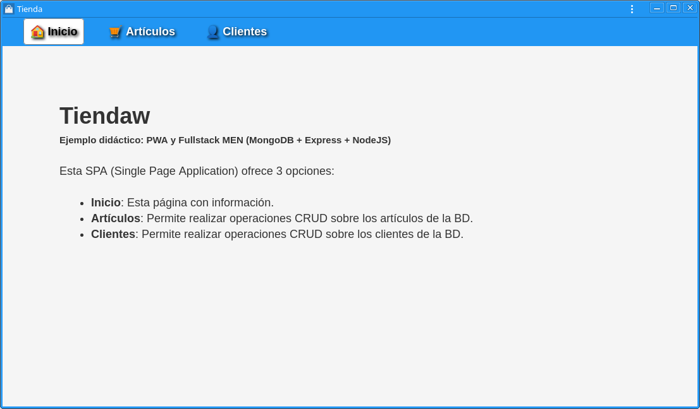


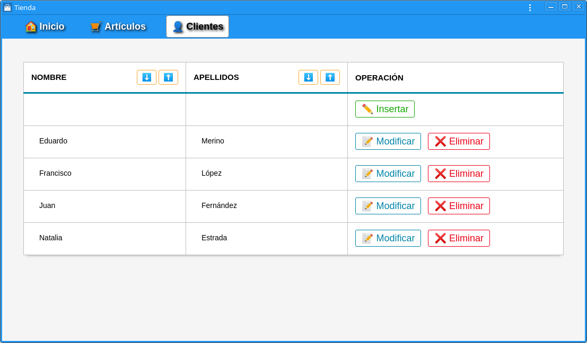

Los archivos utilizados son los siguientes:


```
├── package.json
├── package-lock.json
├── server.js
├── models.js
├── routes.js
├── config.js
├── public
│   ├── manifest.json
│   ├── service-worker.js
│   ├── images/icons/*
│   ├── favicon.png
│   ├── index.html
│   ├── style.css
│   └── app.js
└── README.md
```


Para el BackEnd los archivos necesarios son:

- package.json
- package-lock.json
- index.js
- config.js
- models.js
- routes.js

Para el FrontEnd los archivos necesarios son:

- public/favicon.png
- public/index.html
- public/style.css
- public/app.js

Para Aplicación Web Progresiva

- public/manifest.json
- public/service-worker.js
- public/images/icons/*

 
  
## Despliegue en local

Para poder ejecutar este proyecto en tu equipo local, sigue los siguientes pasos: 

1. Instala el servidor MongoDB. [Consulta la página oficial](https://docs.mongodb.com/manual/installation/).
2. Clona este repositorio en tu equipo:
  ```bash
  git  clone  https://github.com/jamj2000/tiendaw.git
  cd   tiendaw
  ```
3. Instala los módulos necesarios;
  ```bash
  npm  install
  ```
4. Inicia la aplicación
  ```bash
  npm  start
  ```
5. Abre en el navegador web la URL `http://localhost:3000`.
  

## Despliegue en Docker

Si deseas mantener limpio tu equipo y no tener que instalar Nodejs ni MongoDB, entonces puedes utilizar Docker.

Para ello, sigue los siguientes pasos:
  
1. Instala el software para Docker. En Ubuntu:

  ```bash
  sudo  apt  install  docker.io  docker-compose
  sudo  adduser  `id -un`  docker
  ```
  Cierra sesión y vuelve a iniciarla para cargar la nueva configuración de usuario ya añadido al grupo docker.


2. Clona este repositorio en tu equipo:
  ```bash
  git  clone  https://github.com/jamj2000/tiendaw.git  &&   cd   tiendaw
  ```

3. Dentro de la carpeta que contiene el código, ejecuta: 

  ```bash
  docker-compose  up  -d
  ```

> **NOTA:** Los puertos 80 y 27017 no deben estar ocupados por ningún servicio previo. Son necesarios para los servicios de Node y Mongo que lanzará Docker.


## Despliegue en Heroku + mLab

Actualmente la aplicación está desplegada en [HEROKU](https://www.heroku.com). Como base de datos utiliza DBaaS MongoDB proporcionado por [MLAB](https://mlab.com).

Si deseas hacer un despligue usando los servicios proporcionados por los sitios anteriores, sigue estos pasos: 

1. Create una cuenta en Heroku. Éste tiene varios [planes](https://www.heroku.com/pricing). Registrate en el plan Free, que aunque está algo limitado es gratis. Aún así se te solicitará un número de tarjeta. Tenlo en cuenta.


2. Instala la herramienta `heroku-cli`. En [este enlace](https://devcenter.heroku.com/articles/heroku-cli) tienes la información necesaria.

3. Clona este repositorio en tu equipo:
  ```bash
  git  clone  https://github.com/jamj2000/tiendaw.git
  cd   tiendaw
  ```

4. Inicia sesión desde el terminal en la cuenta que previamente creaste en Heroku. Y crea una nueva aplicación. 
  
  ```bash
  heroku login --interactive
  heroku create --region eu  nombre_aplicacion
  ```
  
  **NOTA:** Debes sustituir `nombre_aplicacion` por el nombre que desees dar a tu aplicación. Ten en cuenta que no puede tener espacios en blanco ni tildes. Probablemente tengas que probar con varios nombres, pues muchos de ellos ya están ocupados. La opción `--region eu` es para que la aplicación se aloje en servidores de Europa. 
  
5. Despliega el código en Heroku.

  ```bash
  heroku  push  heroku  master
  ```

  Dentro de unos instantes podrás acceder a la aplicación en la url `http://nombre_aplicacion.herokuapp.com`. 
  
  **NOTA:** Debes sustituir `nombre_aplicacion` por el nombre de tu aplicación.
  
  Puedes verla abriendo dicha url en el navegador o ejecutando
  
  ```bash
  heroku  open
  ```
  
  **DESPLIEGUE ALTERNATIVO**

  Podemos hacer uso de nuestro repositorio de GitHub en lugar de utilizar el repositorio que nos proporciona Heroku.

  Para ello, entra en tu cuenta de Heroku y selecciona tu aplicación.

  Pulsa en el apartado **Deploy**. Luego en **Deployment method**, selecciona **GitHub** en lugar de Heroku Git. En el siguiente apartado deberás indicar el repositorio de GitHub donde tienes el código de la aplicación.  

  

  A continuación podemos optar por dos tipos de despliegue:

  - Automático
  - Manual

  El despliegue automático nos permite desentendernos del proceso. Cada vez que realicemos un *push* al repositorio de GitHub, se realizará el despliegue en Heroku. 

  El despliegue automático es menos fiable que el despliegue manual, puesto que podemos realizar un despliegue de código no funcional. Para solucionar esto, marcaremos la casilla **Wait for CI to pass before deploy**. 

  

  >**NOTA:** Marcar la casilla anterior sólo tiene sentido si utilizas un sistema de integración continua como [Travis CI](https://travis-ci.org). Puedes darte de alta en él con tu identidad de GitHub.
  >
  > Previamente deberás haber creado en tu repositorio de GitHub el siguiente archivo **.travis.yml**:
  >
  > ```yaml
  > language: node_js
  > node_js:
  >   - "8"
  > ```
  >
  > Una vez iniciada sesión en TravisCI, deberás añadir el repositorio de GitHub con el código de tu aplicación. Cada vez que realices un *push* al repositorio en GitHub, TravisCI procederá a realizar la construcción (build). El resultado de la operación se indica mediante una insignia o *badge*, en color verde si todo fue correcto y en color rojo si la construcción dio errores.
  >
  > Ahora podrás realizar un *push* o modificar algún archivo del repositorio GitHub y verás a TravisCI en acción. 
  >  
  >
  >
  > Si has realizado todos los pasos anteriores correctamente verás que en tu repositorio GitHub te aparece un nuevo apartado de **environment**.
  >
  >
  >
  > Además, en **Settings -> Webhooks** debes ver los *webhooks* a TravisCI y Heroku.
  >
  >

6. ¿Y los datos?
  
  Los datos de la aplicación se guardan en una base de datos. En este caso hemos usado el DBaaS que nos proporciona [mLab](https://mlab.com). 
  
    
7. Este sitio tiene varios [planes](https://mlab.com/plans/). Escoge el plan Free, que aunque está algo limitado es gratis. 

8. Crea una base de datos MongoDB y apunta los parámetros de configuración.
  
  En concreto deberás anotar 5 datos:
  - El nombre o IP de host donde se aloja la base de datos.
  - El puerto.
  - El nombre de la base de datos.
  - El nombre del usuario.
  - La contraseña de dicho usuario.
  
  

9. Vuelve a la web de Heroku, inicia sesión, selecciona tu aplicación y pincha en el apartado `Settings` y luego en el botón `Reveal Config Vars`. Crea las variables de entorno que se muestran a continuación con los datos que recopilaste en el apartado anterior.

  
  

10. En la parte superior derecha de la página, pulsa en el boton `More` y luego en `Restart all dynos`.


## PWA: Aplicación Web Progresiva

La tecnología PWA es relativamente nueva, iniciandose en el año 2015 bajo el auspicio de **Google**.

Dicha tecnología pretende, mediante la aplicación de pequeñas adaptaciones, usar las **tecnologías web (HTML + CSS + Javascript)** para el **desarrollo de aplicaciones de escritorio y móviles**.

Como el lector entendido en el asunto comprenderá rápidamente, las implicaciones de tal tecnología son enormes:

- **Desarrollo para web, para escritorio y para móvil. Todo en uno.**
- **Simplificación del desarrollo**. 
  - "No es necesario" aprender lenguajes como Java o Swift.
  - "No es necesario" desarrollar de forma nativa (SDKs para Android e iOS).
  - "No es necesario" desarrollar de forma híbrida (Frameworks Cordova, React Native, Angular Ionic. Electron para el escritorio)
- **Uso de Web APIs**, las cuales [son bastantes, muchas de ellas aún en desarrollo](https://developer.mozilla.org/en-US/docs/Web/API): fetch, websockets, geolocalización, audio, speech, ... 
 

En las fechas en las que escribo esto (**Diciembre 2018**), el soporte para Aplicaciones Web Progresivas no está completamente soportado en todos los entornos. Entornos en los que se sabe que están soportadas son:

- PC y portátiles
  - [Windows 10](https://developer.microsoft.com/es-es/windows/pwa) (Chrome 70+) 
  - GNU/Linux (Chrome 70+)
  - Chrome OS (Chrome 67+)
  - Mac (aún bajo desarrollo)
- Móviles 
  - Android
  - iOS (parcial, a partir de iOS 11.3)


### Instalacción en PC o Portátil

El escritorio usado ha sido KDE bajo sistema operativo GNU/Linux. Las especificaciones concretas se muestran a continuación: 

- Google Chrome Versión 71.0.3578.98 (Build oficial) (64 bits)
- Distribución Linux KDE neon 18.04 LTS
  - KDE Frameworks 5.53.0
  - Qt 5.11.2 (compilado con 5.11.2)
  - El sistema de ventanas xcb

Para instalar en el escritorio a través del navegador Chrome, seguimos los siguientes pasos.

1. Pulsamos en el menú del navegador y luego en **Instalar ...**

  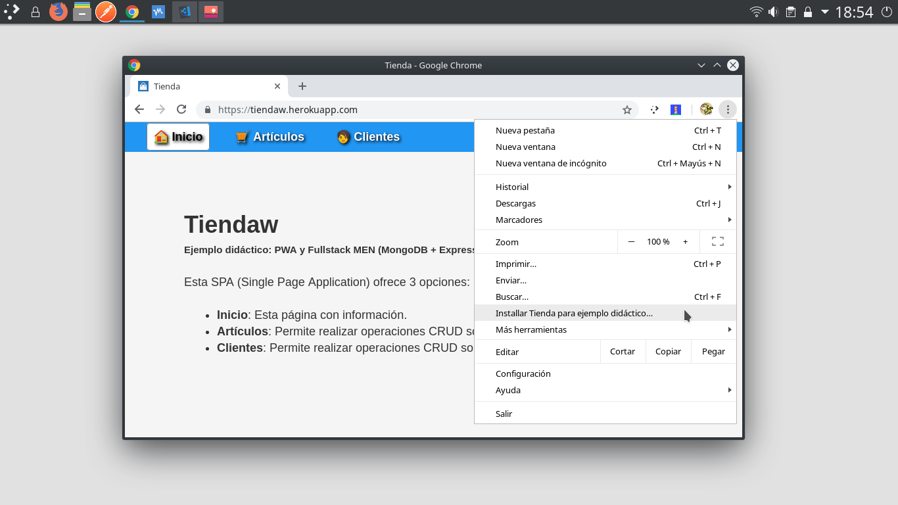
  
2. Confirmamos

  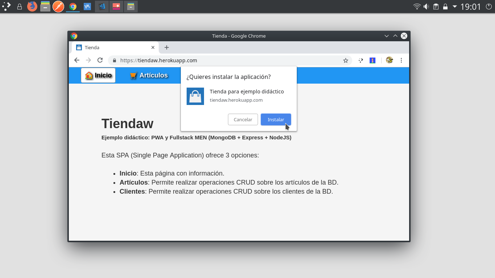

3. Una vez instalada nos aparecerá un icono en el escritorio.

  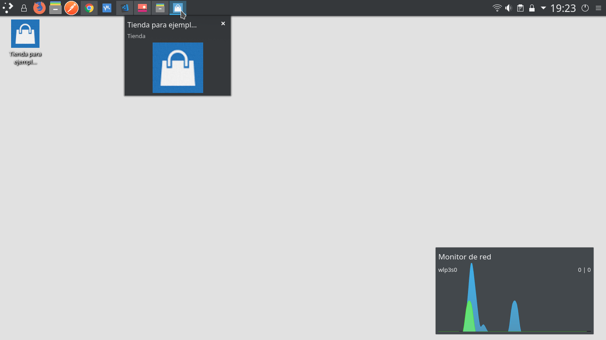

4. Es posible abrir la aplicación desde el navegador, pulsando en el menú y luego en **Abrir ...**

  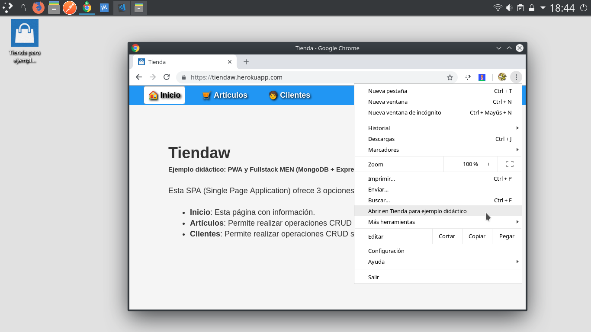

5. No obstante, es más cómodo hacerlo desde el icono del escritorio.

6. Una vez hecho, veremos una ventana con la aplicación.  

  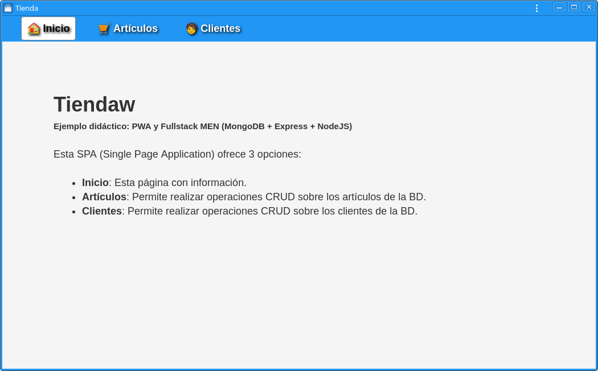
  
  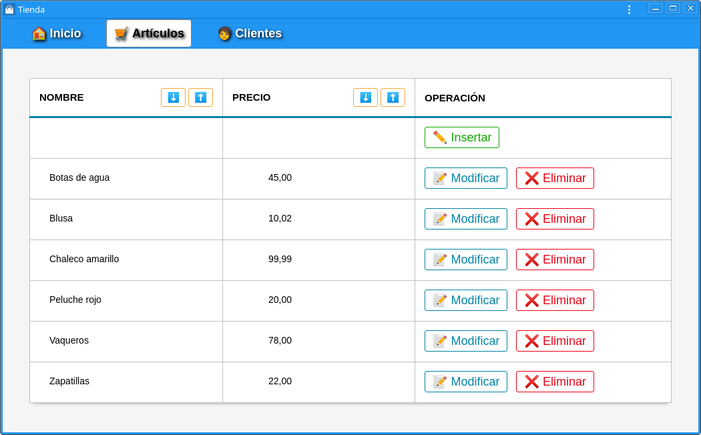
  
  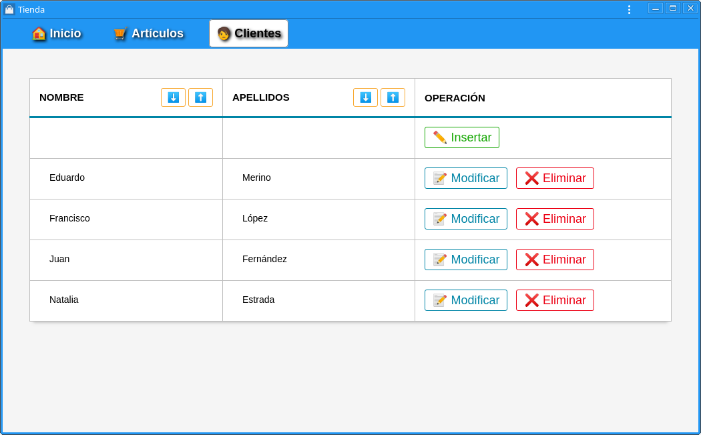


### Auditoría de aplicación web

Podemos realizar una auditoría de la aplicación, haciendo uso de la extensión **Lighthouse** de Chrome. Para instalar dicha extensión en el navegador chrome escribimos la URL chrome://extensions/.

Una vez instalada la extensión, pulsamos en su icono.
  
  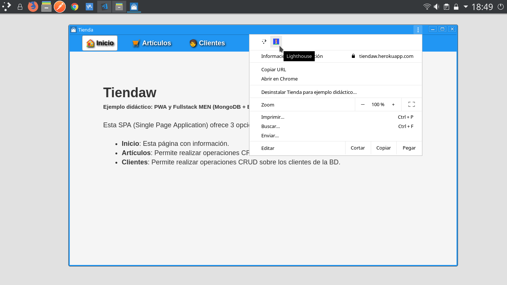
  
Y luego en **Generate report**

  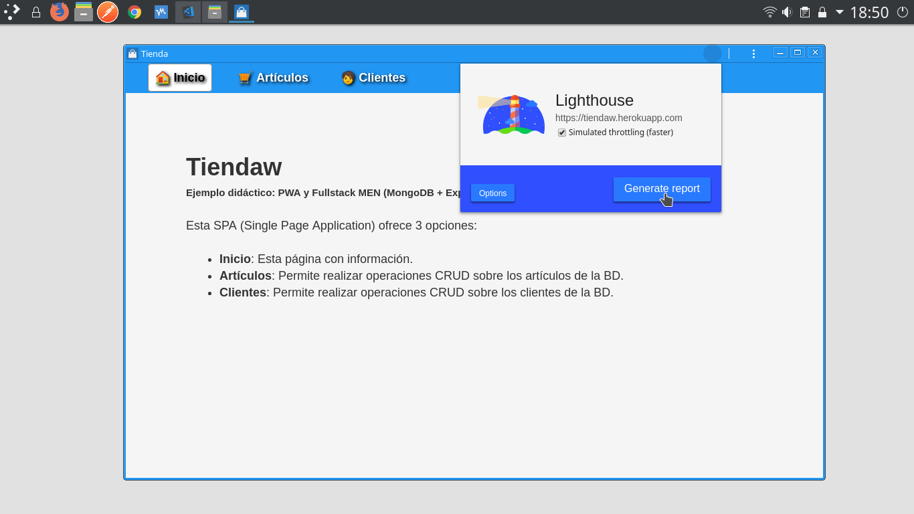

A continuación se nos mostrará un informe similar al siguiente.

  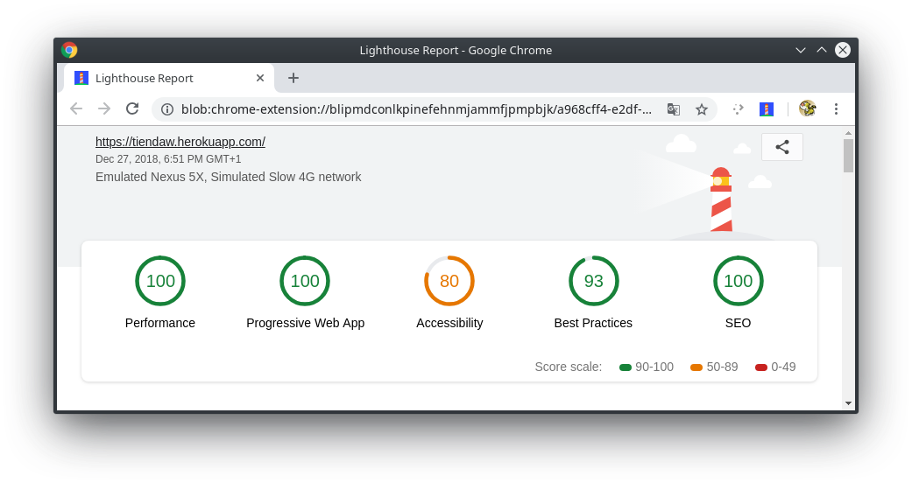

### Desinstalacción en PC o Portátil

Por último, si deseamos desinstalar la aplicación, bastará con pulsar en el menú de la ventana y luego en **Desinstalar ...**

  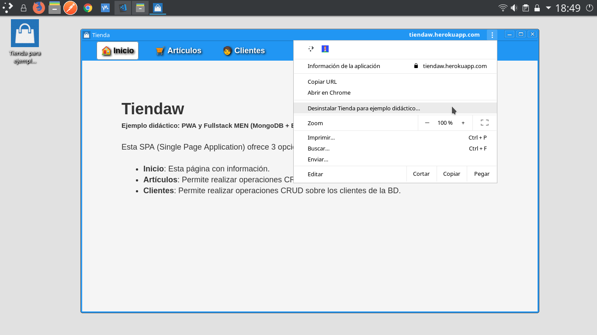


### Instalación en móvil Android

Cuando accedemos a la URL de la aplicación mediante el navegador Chrome, y éste detecta que se trata de una PWA, nos mostrará en la parte inferior de la pantalla del móvil un mensaje para añadir la aplicación web a la pantalla de inicio. El proceso es similar a la instalación de una aplicación Android nativa, aunque suele ser menos pesado y ocupar menos espacio de disco.

A continuación se muestran algunas capturas de pantalla.

Primero pulsamos en el mensaje **Añadir ... a la pantalla de inicio** que aparece en la parte inferior de la pantalla.

  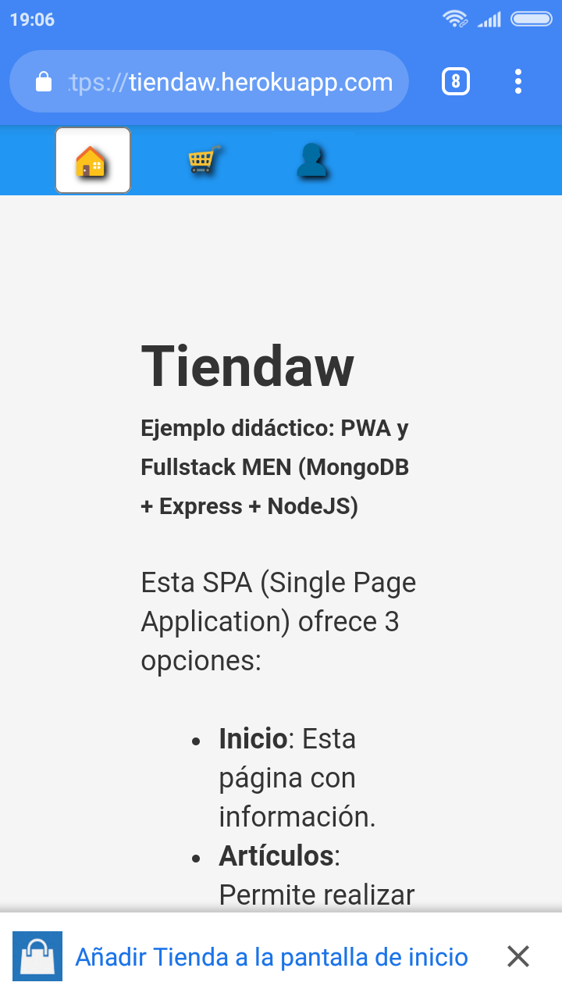

Confirmamos.

  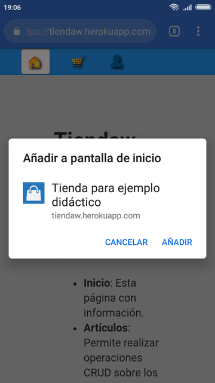

Y podemos ver los detalles de la instalación.

  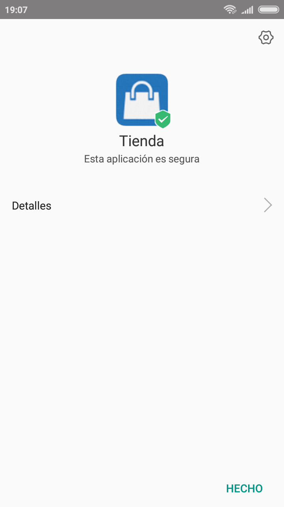


Si no nos aparece el mensaje de instalación en la parte inferior de la pantalla, tenemos otra forma de hacerlo mediante el uso del menú del navegador.

  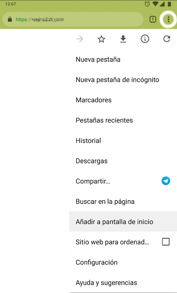

Una vez instalada la aplicación se nos creará un acceso directo en la pantalla de nuestro móvil.

  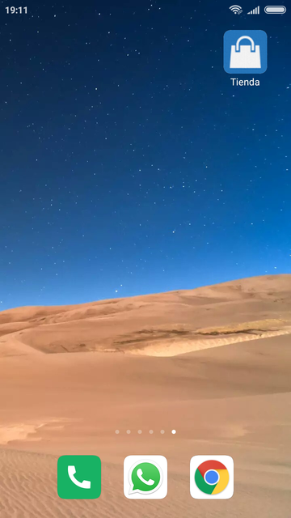

Si abrimos la aplicación veremos algo similar a lo siguiente.

  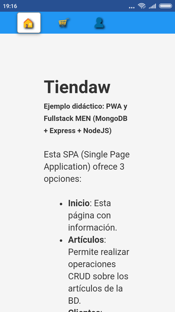

  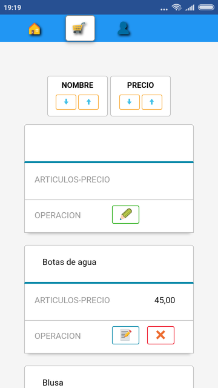
  
A todos los efectos la aplicación aparece en Android como si de una aplicación nativa se tratese. Observese que no aparece incrustada dentro del navegador, sino como aplicación independiente.

  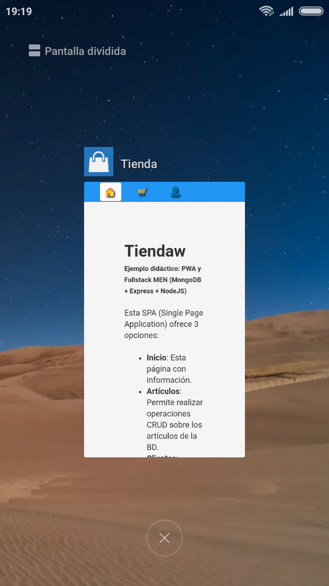
  
Para desinstalar una aplicación en Android bastará con arrastrarla a la papelera.

 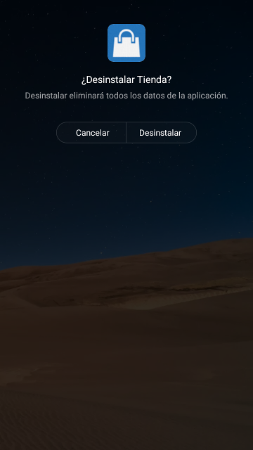


### Listado de aplicaciones de mi alumnado

- **Álvarez-Ossorio Martín, Rafael** :octocat: [Gestión del Olivar](https://github.com/raom30/gestion-olivar) 
  - [Demo en Heroku+mLab](https://gestion-olivar.herokuapp.com/) 
- **Atenciano Rodríguez, Daniel** :octocat: [Almacenes](https://github.com/daniatenciano/Almacenes)
  - [Demo en Heroku+mLab](https://almacenw.herokuapp.com/)
- **Bermudo Delgado, Juan de Dios** :octocat: [Taller](https://github.com/ezxioj87) 
  - [Demo en Heroku+mLab](https://tallerdaw.herokuapp.com/)
- **Cruz Díaz, Jesús Diego**  :octocat: [Instituto](https://github.com/diegocd/instituto)
  - [Demo en Heroku+mLab](https://institutow.herokuapp.com/)
- **Delgado Marín, Jesús** :octocat: [Vivero de plantas](https://github.com/Jesusdm92/viveroplantas) 
  - [Demo en Heroku+mLab](https://viveroplantas.herokuapp.com/)
- **Gómez Carmona, Ramón Jesús** :octocat: [Supermercado](https://github.com/ComandPromt/Supermercado---Node-JS)  
  - [Demo en Heroku+mLab](https://supermercadonode.herokuapp.com/) 
- **Márquez Pérez, José Antonio** :octocat: [Concesionario](https://github.com/santonio97/concesionario) 
  - [Demo en Heroku+mLab](https://concensionariow.herokuapp.com/) 
- **Martín Prieto, Manuel Jesús** :octocat: [Armeria](https://github.com/M25R4PTOR/Armeria) 
  - [Demo en Heroku+mLab](https://daw-armeria.herokuapp.com/) 
- **Morano Pérez, David** :octocat: [Mensajería](https://github.com/davidmoranoperez/Mensajeria) 
  - [Demo en Heroku+mLab](https://mensajeriaw.herokuapp.com/) 
- **Paniagua Gálvez, Amelia** :octocat: [Mercería](https://github.com/AmeliaPaniagua/Merceria)
  - [Demo en Heroku+mLab](https://merceria.herokuapp.com/) 
- **Pérez Rueda, Sergio** :octocat: [Ganadería](https://github.com/sergioperezrueda/Ganaderia)
  - [Demo en Heroku+mLab](https://ganaderiaw.herokuapp.com/) 
- **Quesada Palmero, Iván** :octocat: [Meteorología](https://github.com/ivanquesadapalmero/Meteorologia)
  - [Demo en Heroku+mLab](https://meteorologiaw.herokuapp.com/) 
- **Sánchez Torrijo, Miguel** :octocat: [Hospital](https://github.com/miguelst1/Hospital)
  - [Demo en Heroku+mLab](https://hospitalw.herokuapp.com/) 
